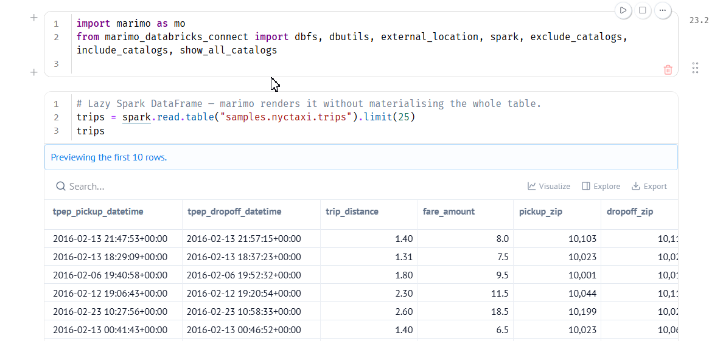
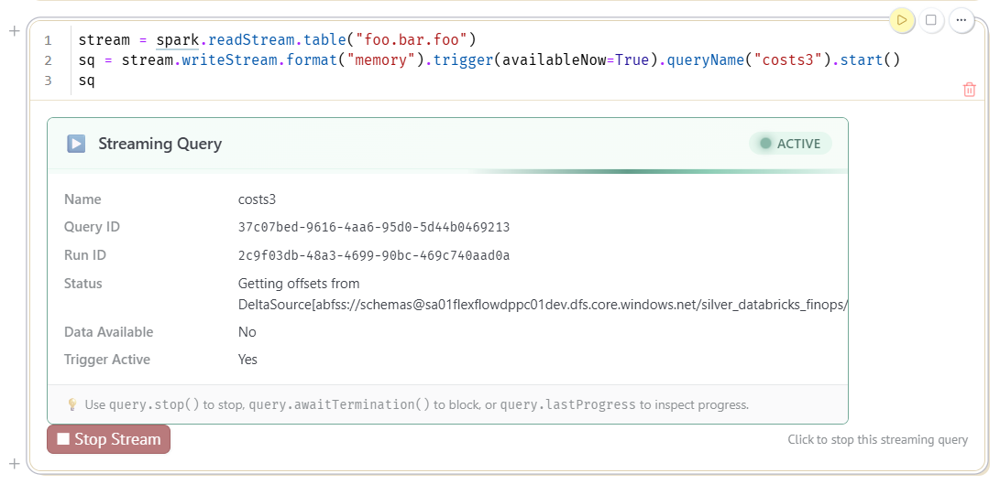
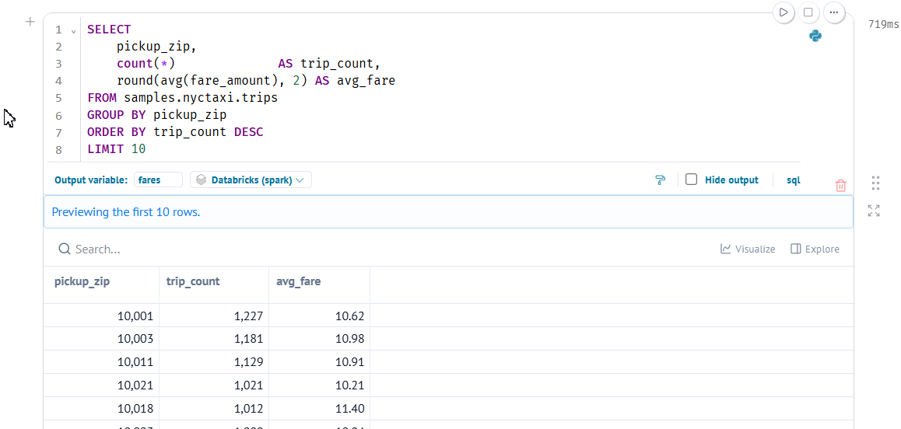
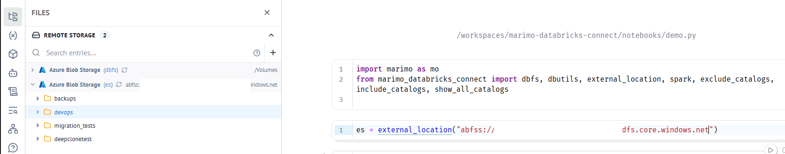
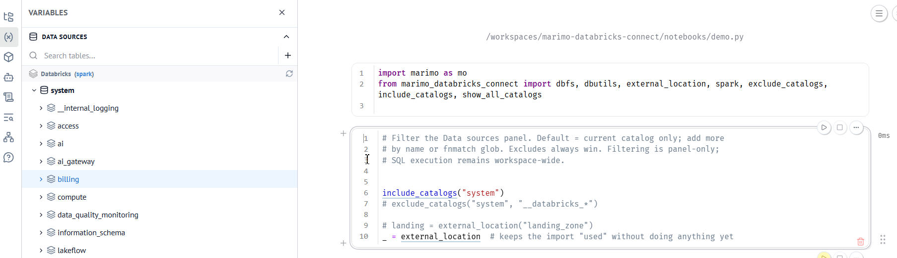
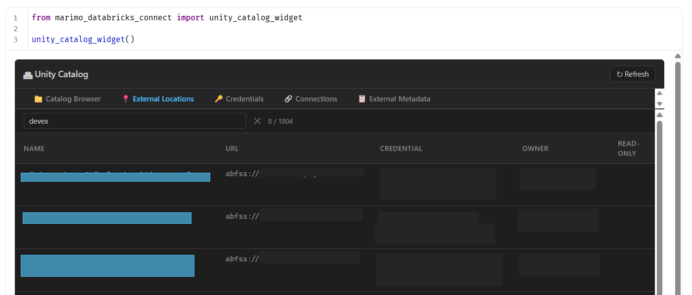
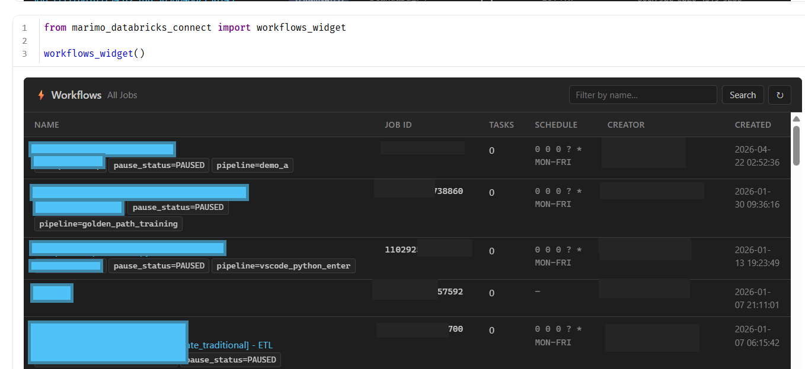
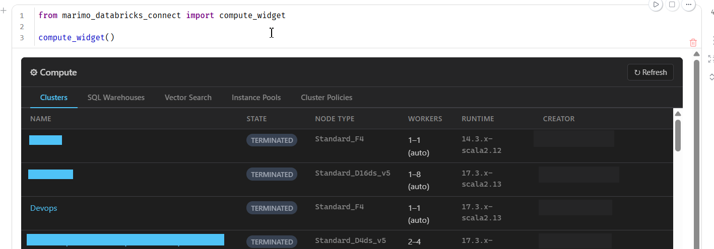

# marimo-databricks-connect

This package provides compatibility for marimo notebooks to use databricks all purpose serverless compute via databricks-connect.  It was designed with the following priorities.

- Connect to databricks using databricks-connect & spark (not sql warehouse)
- Authenticate/configure spark using the default databricks-connect process (env vars, .databrickscfg etc)
- Allow execution of both python & sql
- Allow browsing of catalogs/schemas/tables/columns in the marimo data sources view
- Allow browsing of external locations, volumes, and dbfs in the marimo storage browser
- Widgets to replicate critical parts of the dbr UI (compute, workflows, unity catalog)

## Why Marimo?

We already have databricks notebooks, jupyter, and python.  Why should you try Marimo?  Because it checks all the boxes:

| Code/Format           | Easy Merges | OSS Editor | Visualizations | Runs in Normal Python | REPL |
| -----------           | ----------- |--------------|--------------|--------------|--------------|
| Python                | ✅          | ✅          | ❌           |✅           | ❌ |
| Databricks Notebook   | ✅          | ❌          | ✅           |❌ (ignores magic and sql) |✅|
| Jupyter               | ❌          | ✅          | ✅           |❌           | ✅ |
| Marimo                | ✅          | ✅          | ✅           |✅           | ✅|

Unfortunately, "out of the box", Marimo databricks support isn't great.  This package aims enable all of the cool Marimo features for databricks

### Pyspark

#### Dataframe



#### Streaming



### SQL



## Quickstart

Authenticate once on your machine:

```bash
az login
```

Then in any notebook in this folder:

```python
import marimo as mo
from marimo_databricks_connect import (
    dbfs, dbutils, external_location, spark,
    exclude_catalogs, include_catalogs, show_all_catalogs,
    workflows_widget, compute_widget, unity_catalog_widget,
)
```

That single import gives you:

- `spark` — a `DatabricksSession` on serverless compute (OAuth, no host/token config).
- `dbutils` — bound to that session.
- external_location - Add external locations to browse in the UI
- include/exclude_catalogs - Show/Hide catalogs in the datasource UI
- `dbfs` — an fsspec filesystem rooted at `/Volumes` that powers the marimo
  **storage browser** via Unity Catalog (no direct ADLS access).
- A registered `SparkConnectEngine` so marimo's **data sources** panel browses
  catalogs / schemas / tables, and SQL cells run on Spark when you pass
  `engine=spark`:
  

  ```python
  mo.sql("SELECT * FROM samples.nyctaxi.trips LIMIT 100", engine=spark)
  ```
- **Streaming DataFrame support** — streaming DataFrames (from
  `spark.readStream`) are automatically rendered with their schema and a
  helpful status message instead of silently failing.
- **StreamingQuery display** — streaming queries (from `.writeStream.start()`)
  render a live status card with query name, ID, active state, progress
  metrics, and any exceptions.

## Streaming DataFrames

Streaming DataFrames (`spark.readStream`) cannot be collected or displayed as
tables. This package automatically detects them and renders a schema summary
with column names and types:

```python
stream = spark.readStream.table("catalog.schema.my_table")
stream  # displays schema + STREAMING badge instead of an empty cell
```

Streaming queries (returned by `.writeStream.start()`) are also rendered with a
status card showing the query name, ID, active/stopped state, progress metrics
(batch ID, input rows, rows/sec), source and sink info, and any exceptions:

```python
query = (
    stream.writeStream
    .format("memory")
    .trigger(availableNow=True)
    .queryName("preview")
    .start()
)
query  # displays status card with ACTIVE/STOPPED badge + progress
```

To preview actual data from a streaming source, write to a memory sink and
read the results:

```python
query.awaitTermination()  # wait for availableNow trigger to finish
spark.table("preview")    # now displays as a normal table
```

## Browsing UC external locations

Add a cell to expose another root in the storage browser:

```python
from marimo_databricks_connect import external_location

landing = external_location("finops_landing")                  # by UC name
raw     = external_location("abfss://c@acct.dfs.core.windows.net/data")  # by path
```



Each variable shows up as its own tree in the storage panel.

## Filtering the data sources panel (catalogs / schemas)

With 1000+ UC catalogs the panel becomes unusable. By **default** only the
*current catalog* (`SELECT current_catalog()`) is surfaced. Add catalogs (or
specific schemas) explicitly with fnmatch globs:

```python
from marimo_databricks_connect import (
    include_catalogs, exclude_catalogs, show_all_catalogs, reset_catalog_filter,
)

include_catalogs("main", "samples")            # exact names
include_catalogs("dev_*", "*_prod")             # globs
include_catalogs("main.bronze_*", "*_dev.silver")  # narrow to specific schemas

exclude_catalogs("system", "__databricks_*")    # always wins over includes

show_all_catalogs()                             # opt out of the allow-list
reset_catalog_filter()                          # back to defaults
```

Filtering only affects the **data sources panel** — `mo.sql(..., engine=spark)`
and `spark.sql(...)` can still query any catalog you have UC permission for.

### Persistent defaults

Set once per project in `pyproject.toml`:

```toml
[tool.marimo_databricks_connect]
include_catalogs = ["main", "dev_*"]
exclude_catalogs = ["system", "__databricks_internal"]
# show_all_catalogs = true
```

…or per shell with environment variables (these *override* `pyproject.toml`):

```bash
export MARIMO_DBC_INCLUDE_CATALOGS="main,dev_*"
export MARIMO_DBC_EXCLUDE_CATALOGS="system"
export MARIMO_DBC_SHOW_ALL_CATALOGS=1
```



## Widgets

The package ships two interactive widgets built with [anywidget](https://anywidget.dev/) for exploring your Databricks workspace directly inside marimo notebooks.

### Unity Catalog widget

Browse catalogs, schemas, tables, columns, volumes, and more. Inspect table details, view sample data, explore table & column lineage, and check permissions. Also browse external locations (with drill-through into their contents), storage credentials, connections, and external metadata:

```python
from marimo_databricks_connect import unity_catalog_widget

widget = unity_catalog_widget()
widget  # display in cell output
```


### Workflows widget

Browse jobs, drill into tasks, and view run history:

```python
from marimo_databricks_connect import workflows_widget

widget = workflows_widget()
widget  # display in cell output
```



### Compute widget

Browse clusters, SQL warehouses, vector search endpoints, instance pools, and cluster policies in a tabbed interface:

```python
from marimo_databricks_connect import compute_widget

widget = compute_widget()
widget  # display in cell output
```

All widgets authenticate using the default Databricks auth chain (env vars, `~/.databrickscfg`, `az login`, etc.) when no explicit client is provided.



## Running

```bash
marimo edit scratch/m.py
```
